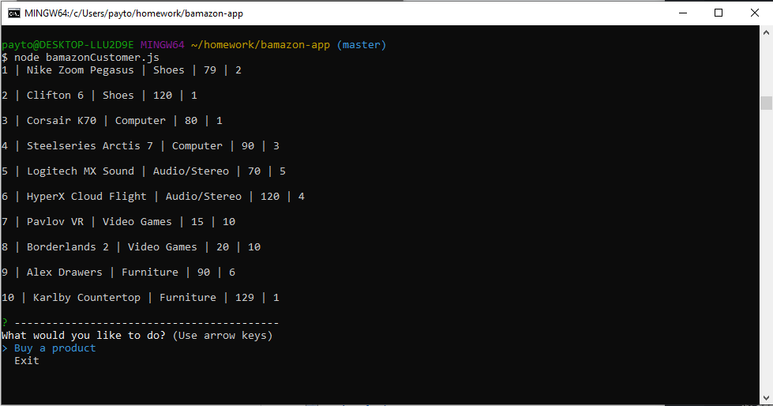

# bamazon-app

### Buy from a list of products.

##### This was made using Node and SQL to generate a list of products that is updated upon purchasing an allowable number of items.

* When the app is run, you will be shown a list of products. You have two options:

  * Buy a product
  * Exit
  
## Preview
  
  
  
#### By selecting `Buy a product` you type what product you would like to buy:

#### And how many you would like to buy:

#### As long as there is enough in stock, it will update the table like so:

